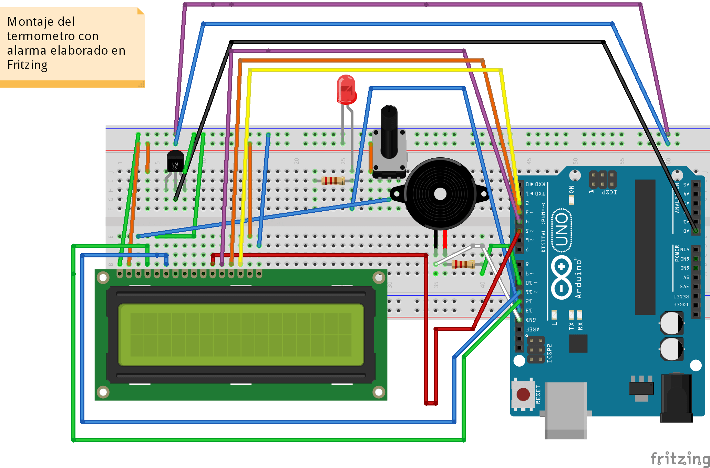
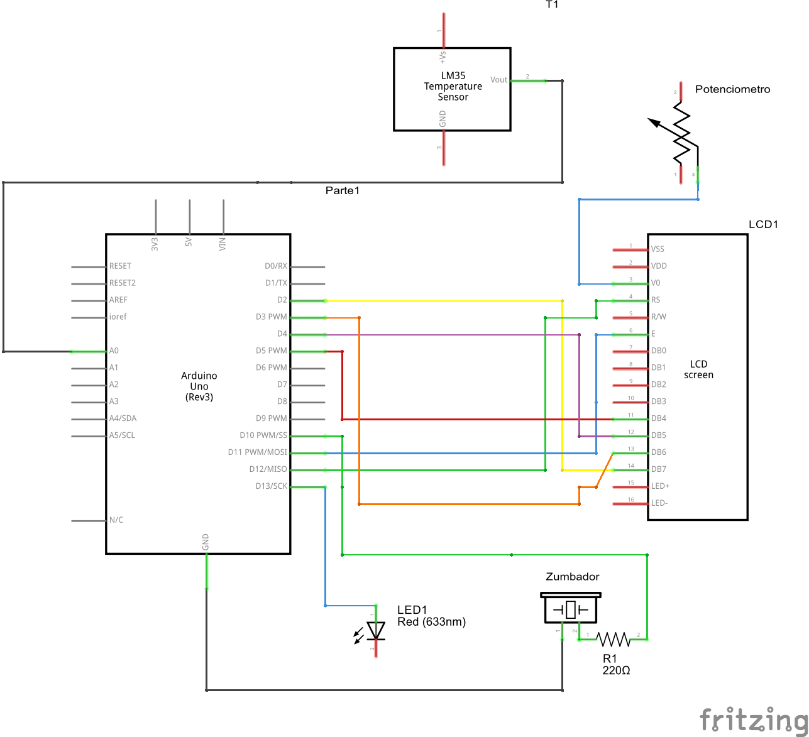

# Termómetro digital con Arduino y LM35

Idiomas: [游쥟릖] [Inglés](README.md) - [游쓇릖쪃 [Español](README-ES.md)

Este es un proyecto para Arduino diseñado para monitorear la temperatura ambiente utilizando un sensor LM35,
un zumbador y una placa Arduino UNO. El objetivo principal de este proyecto es detectar y alertar cuando la
temperatura ambiente supera los 30 grados Celsius, activando el zumbador e iluminando un LED.

## Pre-requisitos

Para ejecutar este proyecto, necesitarás los siguientes componentes:

- Placa Arduino UNO
- Sensor de temperatura LM35
- Zumbador
- LED
- Cables Jumper macho
- Protoboard
- Display LCD 2x16
- Resistencias

## Demo

### El circuito (realizado con Fritzing)

Conecta los componentes como se muestra en el diagrama de conexión. Asegúrate de realizar las conexiones correctamente para evitar errores.

### El esquema (realizado con Fritzing)

## Instalación

Para utilizar este proyecto, sigue los pasos a continuación:

1. Clona este repositorio en tu máquina local.

2. Abre el Arduino IDE.

3. Conecta tu placa Arduino UNO a tu computadora mediante el cable USB.

4. Abre el archivo `termometro.ino` en el IDE de Arduino.

5. Haz clic en el botón **Subir** (Upload) para compilar y cargar el código en tu placa Arduino.

## Uso

1. Cuando la temperatura supere los 30 grados Celsius, el zumbador se activará y el LED se iluminará automáticamente.

2. La pantalla LCD mostrará las lecturas de temperatura en tiempo real del sensor LM35.

3. Puedes modificar el umbral de temperatura y personalizar el proyecto según tus necesidades editando el código en el archivo `termometro.ino`.

## Licencia

Este proyecto está bajo la [Licencia MIT](https://github.com/lupitacode/arduino-temperature-alert/blob/main/LICENSE). Siéntete libre de modificar y distribuir este proyecto para uso personal o comercial.
