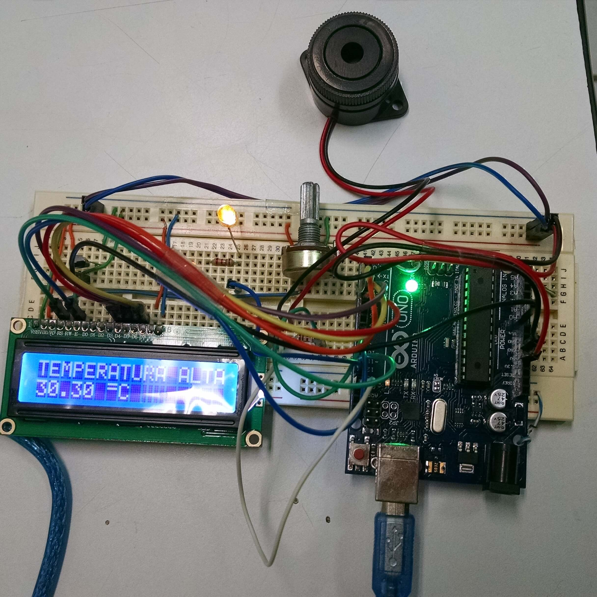
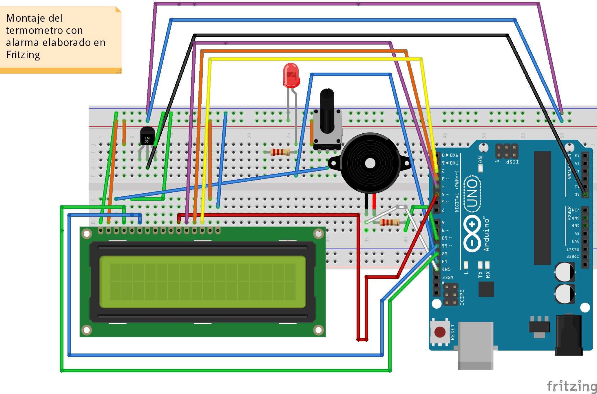
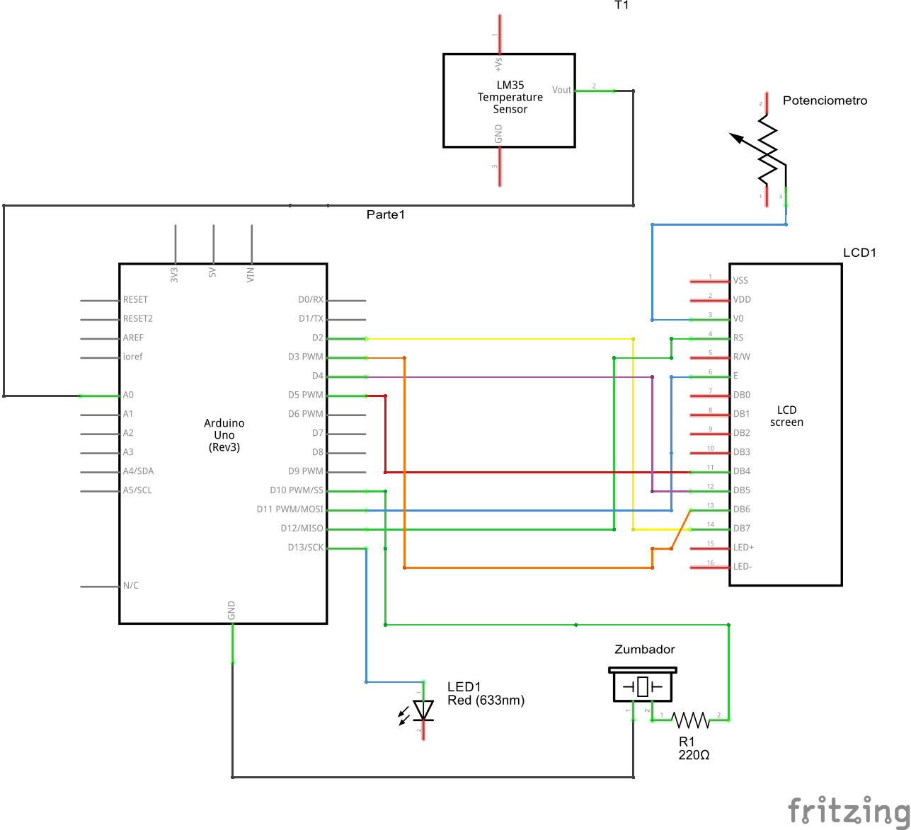

# Digital Thermometer using Arduino and LM35

This is an Arduino project designed to monitor the ambient temperature using an LM35 sensor, a buzzer, and an Arduino UNO board. 
The main objective of this project is to detect and alert when the ambient temperature exceeds 30 degrees Celsius by activating 
the buzzer and illuminating an LED.

## Prerequisites

To run this project, you will need the following components:

- Arduino UNO board
- LM35 temperature sensor
- Buzzer
- LED
- Jumper wires
- Protoboard
- Display LCD 16X2
- Resistors

## Demo

### The circuit (made using Fritzing)
Connect the components as shown in the circuit diagram. Ensure proper wiring and connections to avoid any errors.

### The schematic (made using Fritzing)

## Installation

To use this project, follow the steps below:

1. Clone this repository to your local machine.

2. Open the Arduino IDE.

3. Connect your Arduino UNO board to your computer via USB.

4. Open the `termometro.ino` file in the Arduino IDE.

5. Click on the **Upload** button to compile and upload the code to your Arduino board.

## Usage

1. When the temperature exceeds 30 degrees Celsius, the buzzer will activate and the LED will illuminate.
2. The LCD screen will display the real-time temperature readings from the LM35 sensor.
3. You can modify the temperature threshold and customize the project according to your requirements by editing the code in the `termometro.ino` file.

